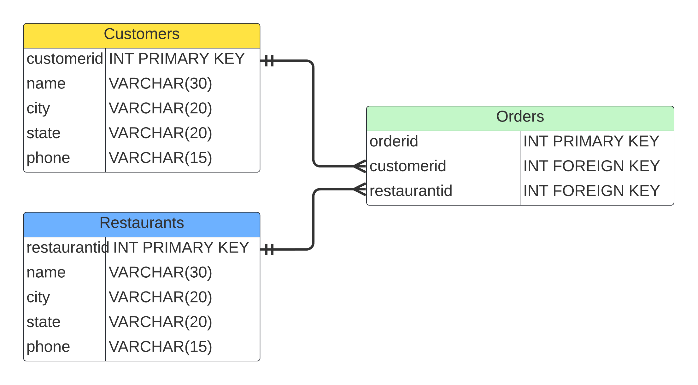

# cs452_natural_languageSQL
Restaurant Database

The database that I decided to implement was a fairly simple database with restaurants, customers, and orders. The main use for a database like this would be to basically inquire about the various orders going through to understand how busy select restaurants were.

# Successful SQL Query

# Unsuccesful SQL Query
